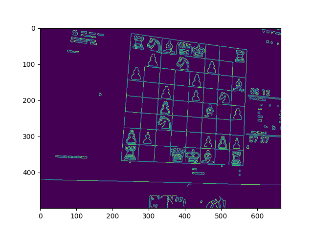

# KnightVision: A Study Aid for Chess Enthusiasts

ChessVision is a tool designed for the academic exploration of Computer Vision and the study of chess games. Leveraging image processing and machine learning techniques, specifically Convolutional Neural Networks (CNN), KnightVision aims to assist chess enthusiasts in analyzing games by converting images of chessboards into digitally understandable formats. This project focuses on the educational aspect of chess, facilitating the evaluation and understanding of game strategies and positions.

**Important Note:** KnightVision is intended strictly for academic and study purposes (Computer Science and Chess). It is not designed to facilitate or encourage cheating in any form. We advocate for the integrity and fair play of chess and encourage the use of this tool in a manner that respects these principles.

## Key Features

- **Chessboard Detection:** Identifies and segments the chessboard within an input image, making allowances for variations in perspective and lighting.

        
  
- **Piece Recognition:** Uses a Convolutional Neural Network to classify each square of the chessboard, recognizing both white and black pieces with precision.

  

   
  
- **FEN Generation:** Translates the visual board setup into Forsyth-Edwards Notation (FEN), offering a standardized description of the game state for analysis or sharing.
  
   
  
- **Position Evaluation:** Provides a static evaluation of the board's position in centipawn units, offering insights into the balance of the game.
- **Strategic Suggestions:** Recommends the top three strategic moves, powered by advanced chess engines.

   => 

## Future Extensions

- **3D physical Chessboard Recognition:** A future aim is to extend the functionality of this tool to recognize Over-The-Board games. This benefits the players who would like to keep track of specific positions to review and analyze them later.
- **Recognize different book openings based on the specific position:** This tool can provide further insights in chess theory as an aid to study chess games and positions.
- **Improve the algorithms to make them more robust and scalable** Utilizing Computer Vision techniques and Neural Networks optimization methods, the tool can be improved to better generalize across different chess platforms.
- **Build a mobile Application**
